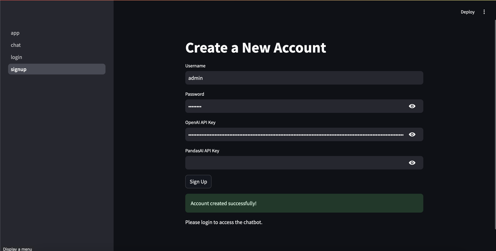
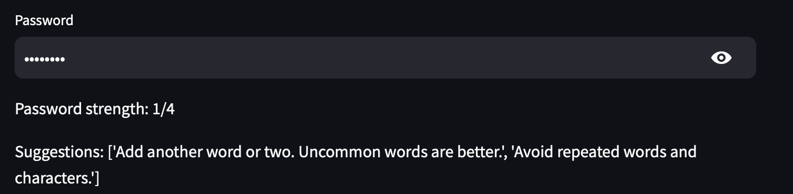
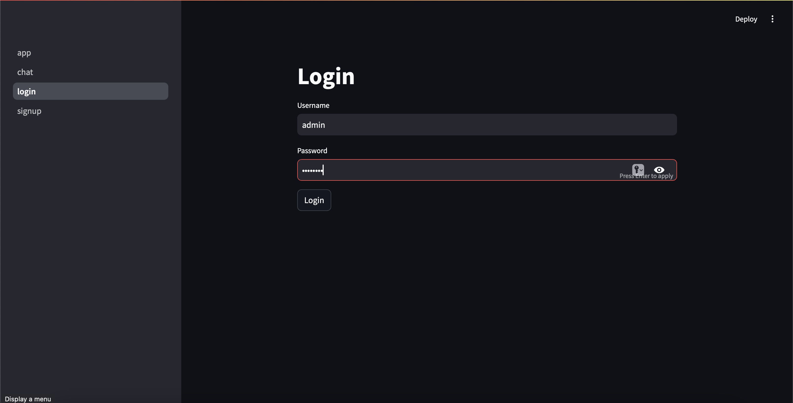
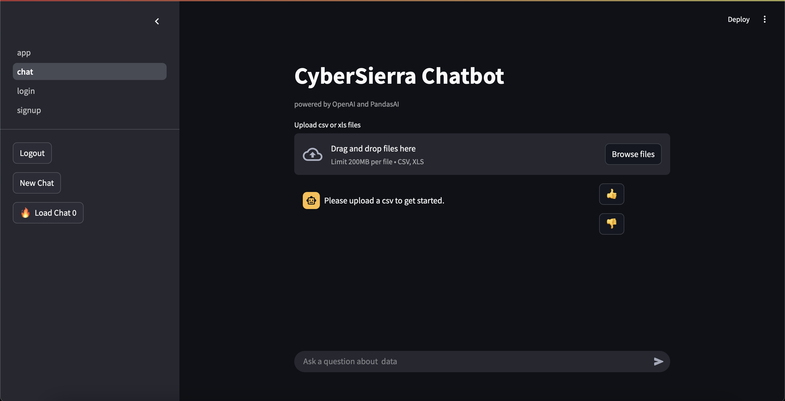

# CyberSierra Chatbot

CyberSierra Chatbot is a Streamlit-based chatbot powered by OpenAI and PandasAI, designed to analyze uploaded CSV or Excel files and provide insights based on user queries.

## Requirements

- Python 3.8+ <3.12

## Installation

1. Clone the repository:
   ```sh
   git clone <repository-url>
   cd <repository-folder>
   ```
2. Create a virtual environment (recommended):
   ```sh
   python3.11 -m venv venv
   source venv/bin/activate  # On Windows, use: venv\Scripts\activate
   ```
3. Install dependencies:
   ```sh
   pip install -r requirements.txt
   ```

## Dependencies

The following dependencies are required:
- `python-dotenv`
- `streamlit`
- `pandasai==3.0.0b16`
- `pandas`
- `pandasai-openai`
- `numpy==1.26.4`
- `xlrd`
- `pandasql`
- `pycryptodomex`
- `cryptography`
- `zxcvbn`

You can install them manually using:
```sh
pip install python-dotenv streamlit pandasai==3.0.0b16 pandas pandasai-openai xlrd numpy==1.26.4 pandasql pycryptodomex cryptography zxcvbn
```

## Usage

Run the Streamlit application:
```sh
streamlit run app.py
```

## Features

- Sign up multiple users
- Login to start chatting 
- Upload CSV or Excel files.
- View a preview of the uploaded data and set the number of preview rows.
- View and continue history chat.
- React to each AI's response
- Chat with the AI to analyze and gain insights from the data (e.g. graph, chart, datagram...).
- Powered by OpenAI for intelligent data analysis.
- User's data are encrypted and stored

## Examples

First, head to sign up page. Enter username, password, and one of the API KEY, either OPENAI or PANDASAI. Then press "Sign Up"


Password recommend system


Head to login page. Enter username and password


Now head to chat page. You can start chatting only after logged in.


This are examples of how the chatbot processes a Titanic dataset and generates visualizations based on user queries.

In this example, the user uploaded titanic.csv, queried the chatbot, and received a plotted distribution of passenger ages.


In this example, the user uploaded titanic.csv, queried the chatbot, and received a datagram that only contains male.


**Ensure you logout before closing the app**


## Folder Structure

```
├── database/                 # Stores all encrypted users' data (apikeys, uploaded files, chat history, ai generated content)
│   ├── <user1>_encrypted.zip 
│   ├── <user2>_encrypted.zip
│   ...
├── venv/                     # Virtual environment (optional)
├── pages                     # Source code for all pages
│   ├── chat.py               # Chat page source code
│   ├── login.py              # Login page source code
│   ├── signup.py             # Sign Up page source code
├── README_pic                # Project documentation pictures
├── app.py                    # Main application script
├── auth.py                   # Authentication logic script
├── database.py               # Database logic script
├── README.md                 # Project documentation
├── requirements.txt          # Required dependencies
├── users.pkl                 # Users' username and password's hash digest
```

## Security Concerns

I assume the use case of this app is user run the app locally. In order to achieve authenticity, user sign up and login is required. User's username and hashed password (using SHA512) is saved in users.pkl. This can prevent attack who gained access to the file can get user's password. All users data is zipped and encrypted using cryptography.fernet (which is secure and the weak point is user's password). The key that used in Fernet is urlsafe_b64encode of SHA256 of user's password. This ensure attacker who gain users.pkl file are not able to decrypt users data file. If attacker capable of manipulate the source code, the encrypted data are still secure. One of the issue I can come up with is the attacker manipulate the source code before user access, in that way I suggest some checking procedure before using the app such as check if the mac of source code are same as the publicly announced application's mac. But Im currently unable to implement that because of short amount of time given.

## Notes

- Ensure that you have a valid OpenAI API key or Pandasai API key before running the application.
- The application creates a `database/` directory to store uploaded files automatically.
- The application creates a `exports/` directory to store generated plot.
- The application creates a `users.pkl` directory to store users' username and password's hash digest

## License

MIT License

