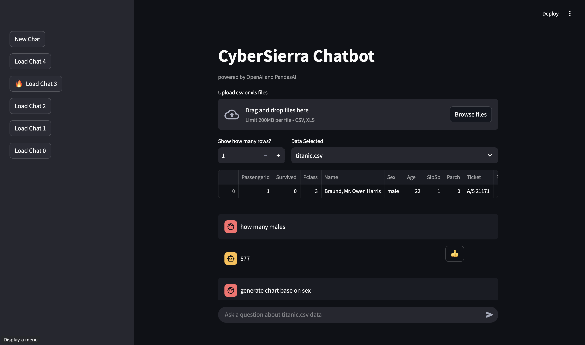
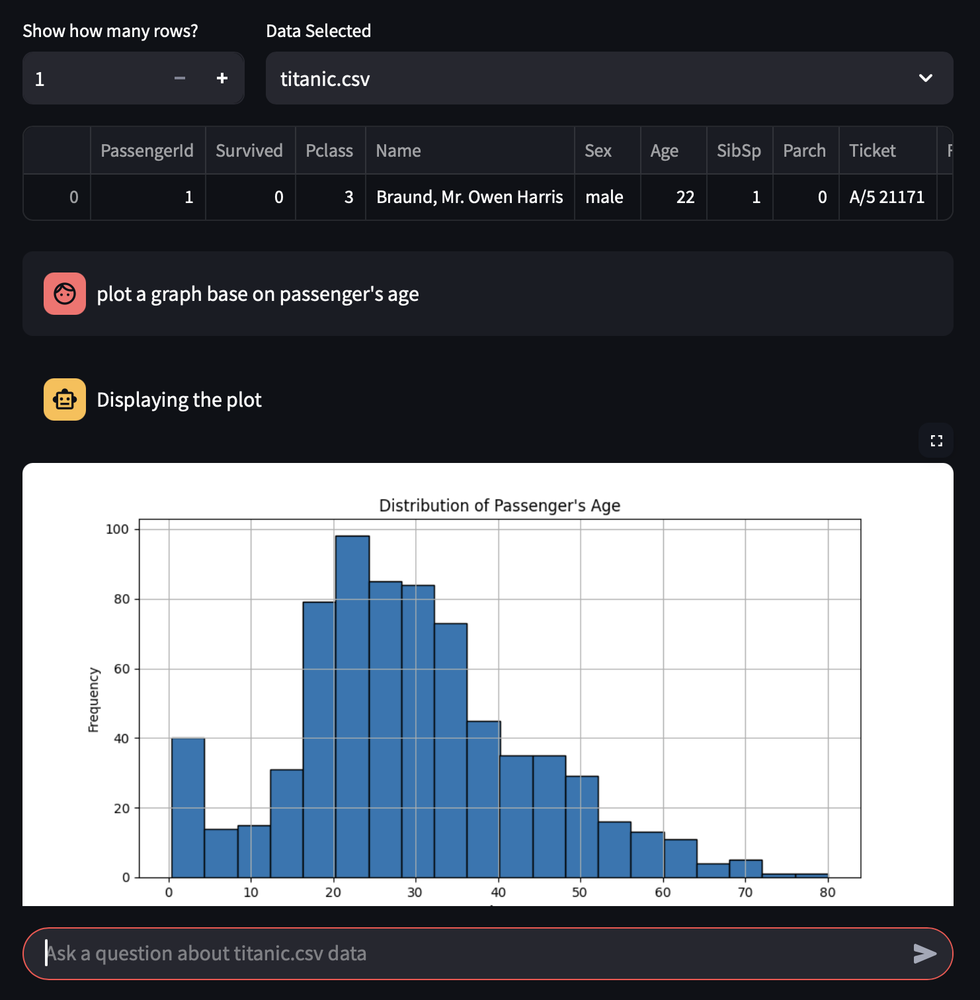
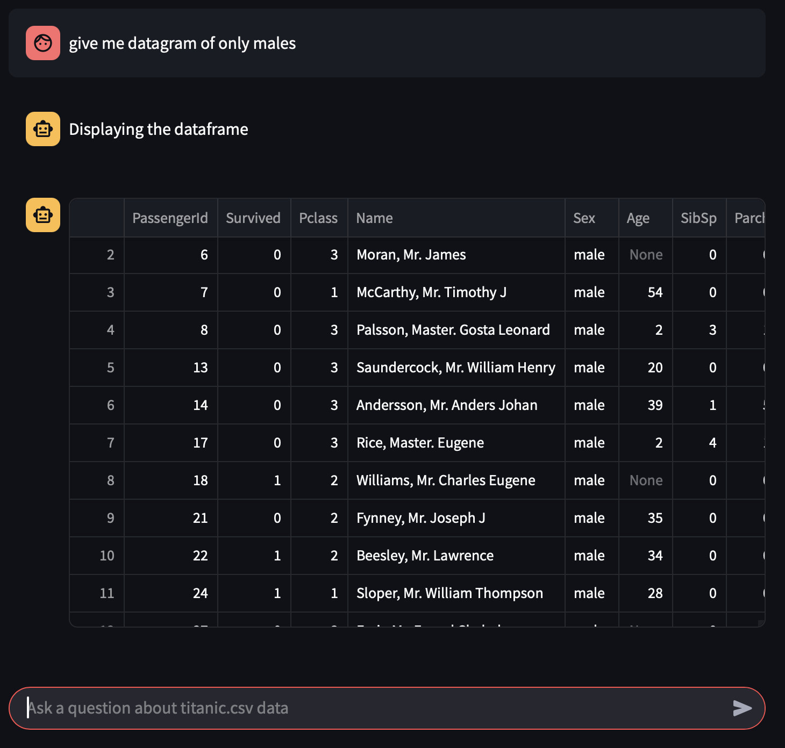

# CyberSierra Chatbot

CyberSierra Chatbot is a Streamlit-based chatbot powered by OpenAI and PandasAI, designed to analyze uploaded CSV or Excel files and provide insights based on user queries.

## Requirements

- Python 3.8+ <3.12

## Installation

1. Clone the repository:
   ```sh
   git clone <repository-url>
   cd <repository-folder>
   ```
2. Create a virtual environment (recommended):
   ```sh
   python3.11 -m venv venv
   source venv/bin/activate  # On Windows, use: venv\Scripts\activate
   ```
3. Install dependencies:
   ```sh
   pip install -r requirements.txt
   ```

## Dependencies

The following dependencies are required:
- `python-dotenv`
- `streamlit`
- `pandasai==3.0.0b16`
- `pandas`
- `pandasai-openai`
- `numpy==1.26.4`
- `xlrd`
- `pandasql`
- `os`
- `json`

You can install them manually using:
```sh
pip install python-dotenv streamlit pandasai==3.0.0b16 pandas pandasai-openai xlrd numpy==1.26.4 pandasql os json
```

## Environment Variables

Before running the application, set up an `.env` file in the project directory with one of the following key:

```sh
OPENAI_API_KEY=<your_openai_api_key>
or 
PANDASAI_API_KEY=<your_pandasai_api_key>
```

## Usage

Run the Streamlit application:
```sh
streamlit run app.py
```

## Features

- Upload CSV or Excel files.
- View a preview of the uploaded data and set the number of preview rows.
- View and continue history chat.
- React to each AI's response
- Chat with the AI to analyze and gain insights from the data (e.g. graph, chart, datagram...).
- Powered by OpenAI for intelligent data analysis.

## Examples
This are examples of how the chatbot processes a Titanic dataset and generates visualizations based on user queries.

In this example, the user uploaded titanic.csv, queried the chatbot, and received a plotted distribution of passenger ages.


In this example, the user uploaded titanic.csv, queried the chatbot, and received a datagram that only contains male.


## Folder Structure

```
├── database/         # Stores uploaded files and chat history 
├── exports/          # Stores pictures generated by pandasai
├── venv/             # Virtual environment (optional)
├── .env              # API keys
├── requirements.txt  # Required dependencies
├── app.py            # Main application script
├── README.md         # Project documentation
├── README_pic        # Project documentation pictures
```

## Notes

- Ensure that you have a valid OpenAI API key or Pandasai API key before running the application.
- The application creates a `data/` directory to store uploaded files automatically.
- The application creates a `exports/` directory to store generated plot.
- The application creates a `pandasai.log` to store AI's generated response.

## License

MIT License

